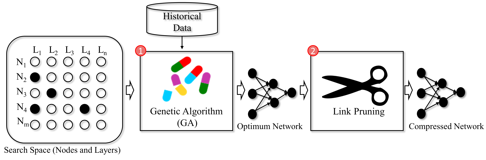

### Publication
Jun, S.W., Sekh, A.A., Quek, C. et al. seMLP: Self-evolving Multi-layer Perceptron in Stock Trading Decision Making. 
SN COMPUT. SCI. 2, 111 (2021). 
[Link to The Paper](https://doi.org/10.1007/s42979-021-00524-9)

### Description
There is a growing interest in automatic crafting of neural network architectures as opposed to expert tuning to find the best architecture. 
On the other hand, the problem of stock trading is considered one of the most dynamic systems that heavily depends on complex trends of the individual company. 
This paper proposes a novel self-evolving neural network system called self-evolving Multi-Layer Perceptron (seMLP) which can abstract the data and produce an optimum 
neural network architecture without expert tuning. seMLP incorporates the human cognitive ability of concept abstraction into the architecture of the neural network. 
Genetic algorithm (GA) is used to determine the best neural network architecture that is capable of knowledge abstraction of the data. After determining the architecture of 
the neural network with the minimum width, seMLP prunes the network to remove the redundant neurons in the network, thus decreasing the density of the network and achieving conciseness. 
seMLP is evaluated on three stock market data sets. The optimized models obtained from seMLP are compared and benchmarked against state-of-the-art methods. The results show that seMLP 
can automatically choose best performing models.

### LSTM Neural Network for Time Series Prediction

LSTM built using the Keras Python package to predict time series steps and sequences. Includes sine wave and stock market data.

[Full article write-up for this code](https://www.altumintelligence.com/articles/a/Time-Series-Prediction-Using-LSTM-Deep-Neural-Networks)

[Video on the workings and usage of LSTMs and run-through of this code](https://www.youtube.com/watch?v=2np77NOdnwk)

### Requirements

Install requirements.txt file to make sure correct versions of libraries are being used.

* Python 3.5.x
* TensorFlow 1.10.0
* Numpy 1.15.0
* Keras 2.2.2
* Matplotlib 2.2.2

Output for sine wave sequential prediction:

Output for stock market multi-dimensional multi-sequential predictions:

### License

Copyright © 2021 Sk. Arif Ahmed

The content of this repository is bound by the following licenses:

- The documents and data are licensed under the MIT license.
